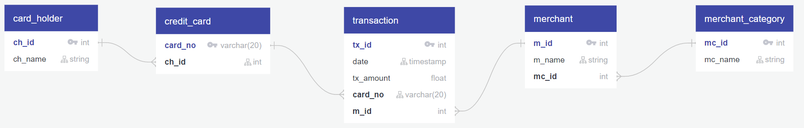
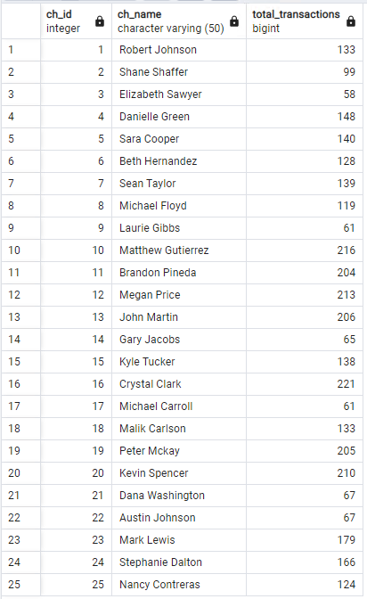

# Module 6 - PyViz Data Visualisation

This is the page for the sixth module of the Fintech Bootcamp course, covering PyViz Data Visualisation.

This page is a continuation of my GitHub learning structure for this course.

## Modules Notes

Above you will see the *^*.ipynb file for this homework.

There is also an img folder with screenshots I've taken from the output of the challenge.

Below I have compiled my analysis, with the images, to support my notebook code for this module challenge.

# Challenge - Looking for Suspicious Transactions

## Contents

* [Data Warehouse & Table Structure](#data-warehouse--table-structure)
* [Data Analysis - Part 1](#data-analysis---part-1)
* [Data Analysis - Part 2](#data-analysis---part-2)
* [Challenge](#challenge)
* [Back to Fintech Home](#back-to-fintech-home)

## Data Warehouse & Table Structure

As this is a data warehouse (static data and not a live transaction database) I configured more indexes to support better queries. Typically you wouldn't do this in transaction tables that need to be more efficient, but for the purposes of this challenge I chose to support efficient querying instead.

Separately to the questions ask for this challenge, there could be argument for additional foreign keys such as merchant category name in the transactions table as well. For example, if you consider more queries about transaction per type of merchant such as money spent in restaurants versus food trucks.

Below is my Entity Relationship Diagram showing the table structure based on the csv files provided:

Transaction ERD 
 

## Data Analysis - Part 1

### Small Transactions

* __*How can you isolate (or group) the transactions of each cardholder?*__
I achieved this by joining the credit_card and card_holder tables to the transaction table as shown below:
'''

CREATE VIEW total_transactions AS

SELECT ch.ch_id, ch.ch_name, COUNT(tx.tx_id) AS total_transactions
	FROM transaction	AS tx
	JOIN credit_card 	AS cc ON cc.card_no = tx.card_no
	JOIN card_holder	AS ch ON ch.ch_id = cc.ch_id
	GROUP BY ch.ch_id
	ORDER BY ch.ch_id

SELECT * FROM total_transactions
'''

This returns the card holder ID, name and total transactions made: 
 

* __*Count the transactions that are less than $2.00 per cardholder.*__
include view

* __*Is there any evidence to suggest that a credit card has been hacked? Explain your rationale.*__
include view

### Time Periods

* __*What are the top 100 highest transactions made between 7:00 am and 9:00 am?*__
include view

* __*Do you see any anomalous transactions that could be fraudulent?*__
include view

* __*Is there a higher number of fraudulent transactions made during this time frame versus the rest of the day?*__
include view

* __*If you answered yes to the previous question, explain why you think there might be fraudulent transactions during this time frame.*__
include view

### Top 5 Merchants Targeted

* __*What are the top 5 merchants prone to being hacked using small transactions?*__
include view

## Data Analysis - Part 2

### Top Two Customers

* __*Using hvPlot, create a line plot representing the time series of transactions over the course of the year for each cardholder separately.*__

* __*Next, to better compare their patterns, create a single line plot that contains both card holders' trend data.*__

* __*What difference do you observe between the consumption patterns? Does the difference suggest a fraudulent transaction? Explain your rationale.*__

### Biggest Customer

* __*Using hvPlot, create a box plot, representing the expenditure data from January 2018 to June 2018 for cardholder ID 25.*__

* __*Are there any outliers for cardholder ID 25? How many outliers are there per month?*__

* __*Do you notice any anomalies? Describe your observations and conclusions.*__

## Challenge

## Back to Fintech Home

* [Fintech Bootcamp Home](https://github.com/d4np3/fintech-home)