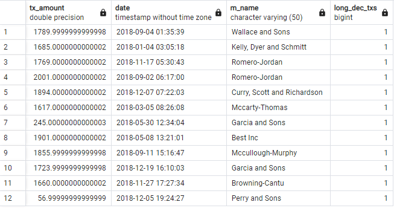

# Module 7 - SQL Data Analysis

This is the page for the seventh module of the Fintech Bootcamp course, covering SQL Data Analysis using PostgreSQL.

This page is a continuation of my GitHub learning structure for this course.

## Modules Notes

Above you will see the ***.sql files and *^*.ipynb file for this homework.

There is also an img folder with screenshots I've taken from the output of the challenge.

Below I have compiled my analysis, with the images, to support my code for this module challenge.

# Challenge - Looking for Suspicious Transactions

## Contents

* [Data Warehouse & Table Structure](#data-warehouse--table-structure)
* [Data Analysis - Part 1](#data-analysis---part-1)
* [Data Analysis - Part 2](#data-analysis---part-2)
* [Challenge](#challenge)
* [Back to Fintech Home](#back-to-fintech-home)

## Data Warehouse & Table Structure

As this is a data warehouse (static data and not a live transaction database) I configured more indexes to support better queries. Typically you wouldn't do this in transaction tables that need to be more efficient, but for the purposes of this challenge I chose to support efficient querying instead.

Separately to the questions ask for this challenge, there could be argument for additional foreign keys such as merchant category name in the transactions table as well. For example, if you consider more queries about transaction per type of merchant such as money spent in restaurants versus food trucks.

Below is my initial (more on this later) Entity Relationship Diagram showing the table structure based on the csv files provided:

Transaction ERD</br>
</br>

## Data Analysis - Part 1

### Small Transactions

* __*How can you isolate (or group) the transactions of each cardholder?*__

I achieved this by joining the credit_card and card_holder tables to the transaction table as shown below:
```
CREATE VIEW total_transactions AS

SELECT ch.ch_id, ch.ch_name, COUNT(tx.tx_id) AS total_transactions
	FROM transaction	AS tx
	JOIN credit_card 	AS cc ON cc.card_no = tx.card_no
	JOIN card_holder	AS ch ON ch.ch_id = cc.ch_id
	GROUP BY ch.ch_id
	ORDER BY ch.ch_id

SELECT * FROM total_transactions
```

This returns the card holder ID, name and total transactions made:</br>
</br>
</br>

* __*Count the transactions that are less than $2.00 per cardholder.*__
I achieved this by altering the previous query to count transaction amount where less than $2:
```
CREATE VIEW total_sub2_tx AS

SELECT ch.ch_id, ch.ch_name, COUNT(tx.tx_amount) AS total_sub2_tx
	FROM transaction	AS tx
	JOIN credit_card 	AS cc ON cc.card_no = tx.card_no
	JOIN card_holder	AS ch ON ch.ch_id = cc.ch_id
	WHERE tx.tx_amount < 2.00
	GROUP BY ch.ch_id
	ORDER BY ch.ch_id

SELECT * FROM total_sub2_tx
```

This shows the same format but only for the low transactions under $2:</br>
</br>
</br>

* __*Is there any evidence to suggest that a credit card has been hacked? Explain your rationale.*__

It is difficult to say at this stage. When you compare the number of sub-$2 transactions to the total number of transactions, they appear to align with the total activity on each card holders card. There isn't a standout card holder with low activity but high sub-$2 transactions when you look at the percentage per card holder. Those with lower overall transactions have low sub-$2 transactions and those with high overall transactions have a higher number of sub-$2 transactions. It would be difficult for hackers to know how much other usage is on cards to align the activity accordingly (unless they had hacked the banks accounts as well).

Having said that, it is interesting to see that there are a number of small transactions of the same exact amount (as shown below):</br>
</br>
</br>

This could indicate that a small selection of card holders are being targeted, making it less obvious. Or it could be a coincidence.

### Time Periods

* __*What are the top 100 highest transactions made between 7:00 am and 9:00 am?*__

The top 100 highest transactions were shown using the following query:
```
CREATE VIEW top_7to9_txs AS

SELECT tx.tx_amount, tx.date, COUNT(tx.tx_id) AS top_7to9_txs
	FROM transaction	AS tx
	WHERE tx.date::time BETWEEN time '07:00:00' AND time '09:00:00'
	GROUP BY tx.tx_amount, tx.date
	ORDER BY tx.tx_amount desc
	LIMIT 100
;

SELECT * FROM top_7to9_txs;
```
Here is a snippet of the output as it is too long to post here:</br>
</br>
</br>

* __*Do you see any anomalous transactions that could be fraudulent?*__

There are a couple of interesting transaction amounts at the top with long decimal places that likely indicates fraudulent activity:</br>
</br>
</br>

* __*Is there a higher number of fraudulent transactions made during this time frame versus the rest of the day?*__

It is hard to say. We are just assuming all transactions under $2 are fraudulent. I would say looking at high transaction amounts with long decimal numbers is more suspicious.

* __*If you answered yes to the previous question, explain why you think there might be fraudulent transactions during this time frame.*__

Running the following query, looking specifically for transactions with long decimal places:
```
CREATE VIEW long_dec_txs AS

SELECT tx.tx_amount, tx.date, COUNT(tx.tx_id) AS long_dec_txs 
	FROM transaction	AS tx
	WHERE tx.tx_amount != ROUND(tx.tx_amount::numeric,2)
	GROUP BY tx.tx_amount, tx.date
	ORDER BY tx.date::time
;

SELECT * FROM long_dec_txs;
```

We can see that there are a number of these transactions throughout the day and on various days, including overnight or very early mornings:</br>
</br>
</br>


### Top 5 Merchants Targeted

* __*What are the top 5 merchants prone to being hacked using small transactions?*__

If we are looking at small (sub $2) transactions, I have found the top 5 merchants with the most small transactions using the following query:
```
CREATE VIEW top_sub2_merchant_txs AS

SELECT tx.m_id, m.m_name, COUNT(tx.m_id) AS top_sub2_merchant_txs
	FROM transaction	AS tx
	JOIN merchant 		AS m ON m.m_id = tx.m_id
	WHERE tx.tx_amount < 2.00
	GROUP BY tx.m_id, m.m_name
	ORDER BY COUNT(tx.tx_id) desc
	LIMIT 5
;

SELECT * INTO TABLE top5mc FROM top_sub2_merchant_txs;
SELECT * FROM top5mc;
```

I added the results above into another table called 'top5mc':</br>
</br>
</br>

This has altered my original ERD to look like the following:</br>
</br>
</br>

I further investigated specific individual 'small' transactions, on a per mechant basis, joining pre-existing tables with the newly created table (top5mcc) to focus on specific low value transactions:
```
CREATE VIEW all_sub2_merchant_txs AS

SELECT tx.m_id, m.m_name, tx.tx_amount AS all_sub2_merchant_txs
	FROM transaction	AS tx
	JOIN merchant 		AS m ON m.m_id = tx.m_id
	JOIN top5mc			AS t5 ON t5.m_id = tx.m_id
	WHERE tx.tx_amount < 2.00 AND tx.m_id = t5.m_id
	GROUP BY tx.m_id, m.m_name, tx.tx_amount
	ORDER BY m.m_name

SELECT * FROM all_sub2_merchant_txs
```
I compared the top 5 merchants with small transactions against long decimal transactions and none matched (unfortunately! I really expected some to!).
```
CREATE VIEW merc_long_txs AS

SELECT tx.tx_amount, tx.date, m.m_name AS merc_long_txs
	FROM transaction	AS tx
	JOIN merchant 		AS m ON m.m_id = tx.m_id
	JOIN top5mc			AS t5 ON t5.m_id = tx.m_id
	WHERE tx.tx_amount != ROUND(tx.tx_amount::numeric,2)
	AND tx.m_id = t5.m_id
	GROUP BY tx.tx_amount, tx.date, m.m_name 
	ORDER BY m.m_name
;

SELECT * FROM merc_long_txs;
```

## Back to Fintech Home

* [Fintech Bootcamp Home](https://github.com/d4np3/fintech-home)